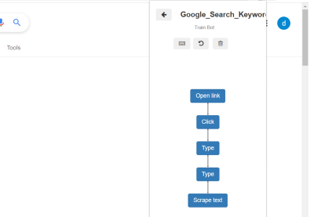

Make Google Search Results Count Api
*************************************

1. Make a new api and click on Record.

2. Open https://www.google.com/ in browser.

3. Now click on input box and type anything to search and press ``ENTER``
  
4. Add a column named ``count`` and click on save.
  
5. Now Right Click on results count> DataKund>Scrape>Text>count

6. As below you can see all the steps recorded in API.

  
6. Go back and Run api.